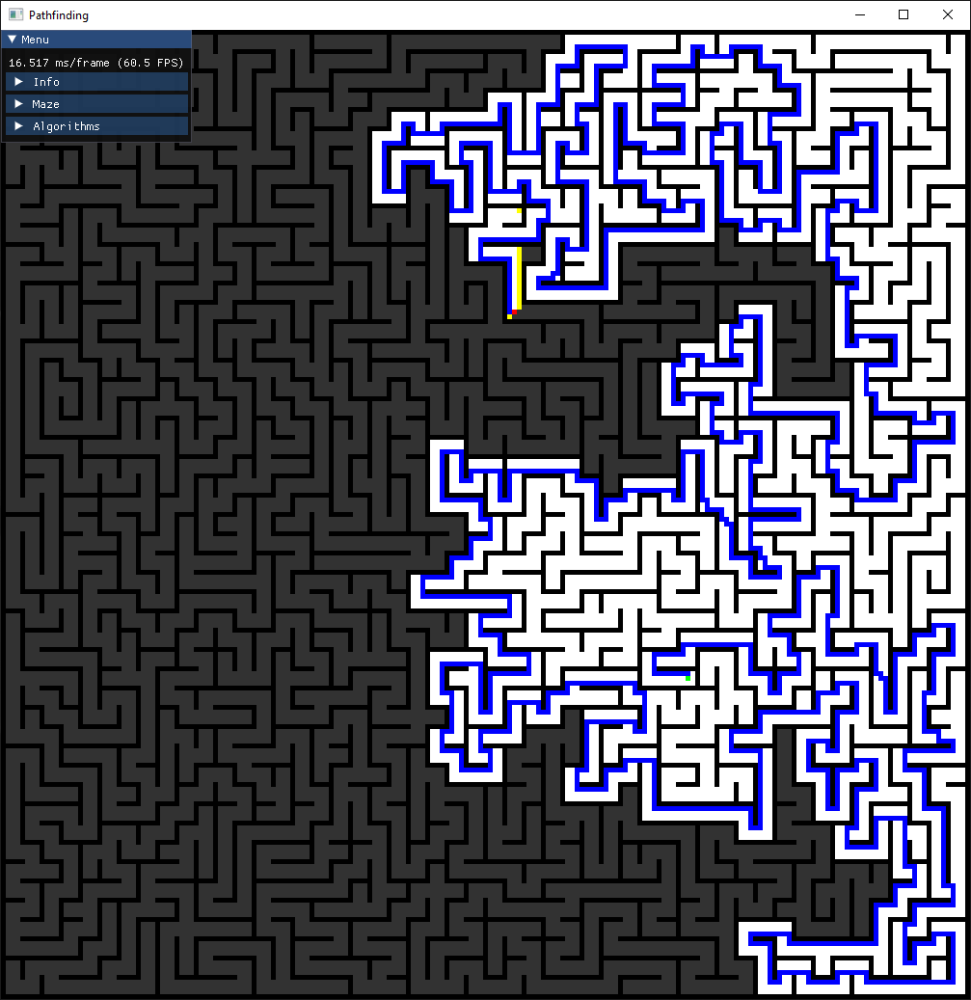

# Pathfinding Visualizer

Interactive visualization of 4 most popular pathfinding algorithms:

- DepthFirstSearch
- BreadthFirstSearch
- Dijkstra's
- A\*

For more information, please build and launch the program.

## Example

<p align="center">
	
</p>

## How to compile

```
mkdir build
cd build
cmake -DCMAKE_BUILD_TYPE=Release ..
cmake --build . --config Release
./src/Pathfinding # Linux
.\Release\Pathfinding.exe # Windows
```

## Dependencies

CMake >= 3.16

In case you're on Linux, you'll need to install dependencies for building SFML
specified [here](https://www.sfml-dev.org/tutorials/2.5/compile-with-cmake.php#installing-dependencies).
